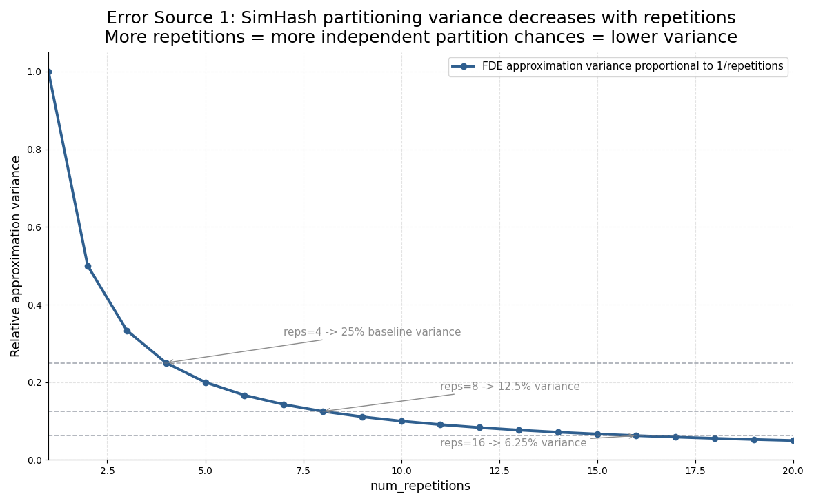
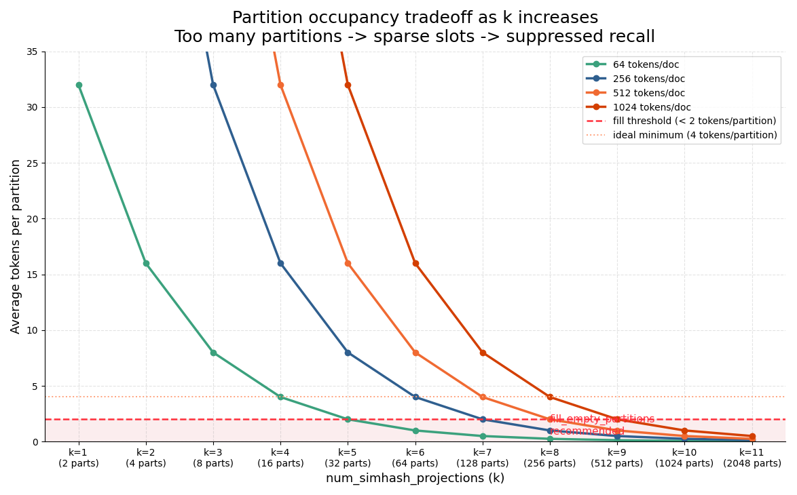
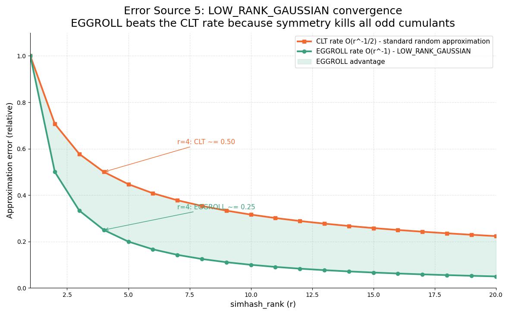
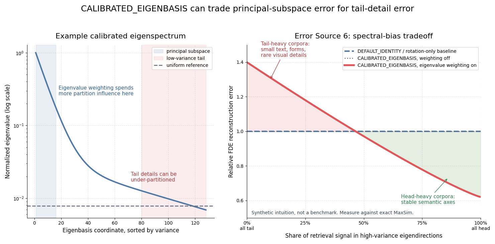
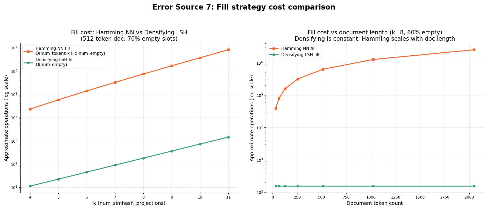
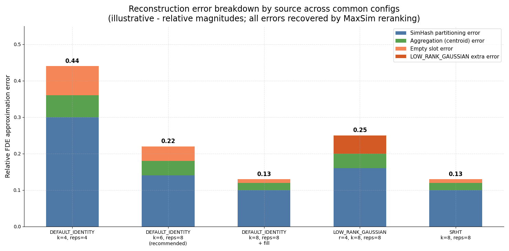
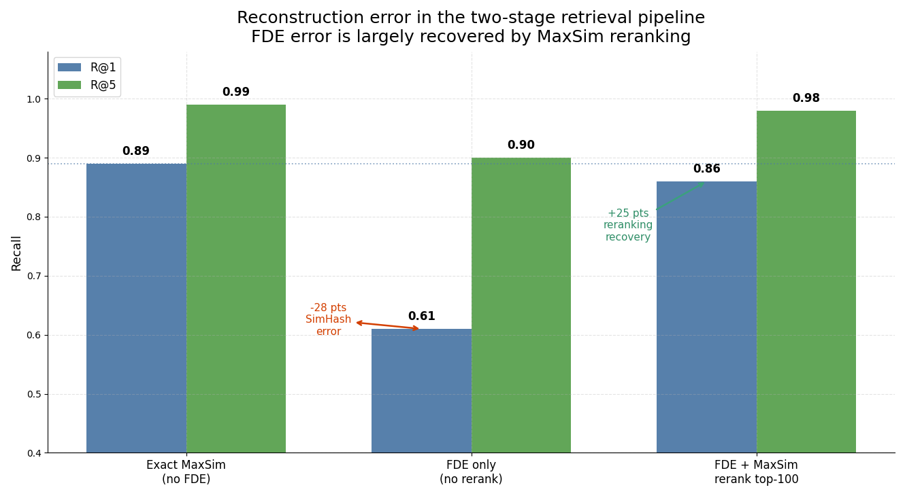

# pymuvera — MUVERA + EGGROLL + Spectral SimHash: Fixed Dimensional Encodings for Multi-Vector Retrieval

**Sublinear ANN retrieval for ColBERT, ColPali, ColQwen2, and ColQwen3.5.**

[](https://pypi.org/project/pymuvera/)
[](https://pypi.org/project/pymuvera/)
[](https://github.com/smarthi/pymuvera/actions)
[](LICENSE)

A pure-Python port of Google's graph-mining MUVERA implementation, extended with
**low-rank SimHash factorisation** (EGGROLL, Sarkar et al., 2025),
**Subsampled Randomized Hadamard Transform** (SRHT, Woolfe, Liberty, Rokhlin & Tygert, 2008),
**Cross-Polytope LSH** (Andoni & Razenshteyn, 2015),
**Densifying LSH fill** (Shrivastava, 2014), and
**Calibrated Eigenbasis SimHash** with eigenvalue-weighted partitioning
(inspired by SpectralQuant, Vangara & Gopinath, 2026).

| | Reference |
|---|---|
| MUVERA paper | [Dhulipala et al., 2024](https://arxiv.org/abs/2405.19504) |
| EGGROLL paper (LOW_RANK_GAUSSIAN) | [Sarkar et al., 2025](https://eshyperscale.github.io/imgs/paper.pdf) |
| SRHT | [Woolfe, Liberty, Rokhlin & Tygert, 2008](https://doi.org/10.1016/j.acha.2007.12.002) |
| Cross-Polytope LSH | [Andoni & Razenshteyn, 2015](https://arxiv.org/abs/1509.02897) |
| Densifying LSH | [Shrivastava, 2014](https://arxiv.org/abs/1401.4605) |
| CALIBRATED_EIGENBASIS inspiration | [SpectralQuant](https://github.com/Dynamis-Labs/spectralquant), Vangara & Gopinath, 2026 |
| Original C++ implementation | [google/graph-mining](https://github.com/google/graph-mining/tree/main/sketching/point_cloud) |

---

## v0.4.2 highlights

v0.4.2 documents `CALIBRATED_EIGENBASIS` as an experimental SpectralQuant-inspired
FDE/LSH adaptation, adds explicit SpectralQuant attribution, and calls out the main
Eigenbasis reconstruction-risk tradeoff: eigenvalue weighting can improve semantic
collisions when high-variance directions carry signal, but it can hurt recall when
important matches live in low-variance tail directions. The reconstruction-error
section below includes the restored plots from the v0.4.1 docs plus a new
Eigenbasis-specific spectral-bias plot and caveats. The plot PNGs can be
regenerated with `python docs/generate_readme_plots.py`.

---

## What this library adds beyond the original paper

The MUVERA paper uses a full-rank Gaussian matrix for SimHash partitioning and
Hamming nearest-neighbor fill for empty partitions. This library adds five
capabilities:

**`LOW_RANK_GAUSSIAN`** (EGGROLL, Sarkar et al., 2025) factors the SimHash matrix
as AB⊤ (`A ∈ ℝ^{d×r}`, `B ∈ ℝ^{k×r}`, `r ≪ k`), cutting partition cost from
`O(N·d·k)` to `O(N·d·r + N·r·k)`. O(r⁻¹) convergence to full-rank, faster than
the CLT rate. At r=4, ColQwen2 (d=128, k=8): **~1.9× faster**, ~25% variance increase.

**`SRHT`** (Woolfe et al., 2008) applies a structured `S·H·D` transform at
`O(N·d·log d)` cost, independent of k. The linear projection has a JL-style
distance-preservation guarantee; sign partitioning remains a SimHash heuristic.
For ColQwen2 (d=128, k=8): 904N vs 1024N ops.

**`CROSS_POLYTOPE`** (Andoni & Razenshteyn, 2015) uses `argmax(|H·D·x|)` instead
of sign-based SimHash, producing 2·padded_dim partitions per repetition aligned with
the Voronoi cells of the cross-polytope — **theoretically optimal for cosine
similarity** in high dimensions. For ColQwen2 (d=128): 256 partitions at O(d log d)
cost. For ColQwen3.5 (d=320): 1024 partitions.

**Densifying LSH fill** (Shrivastava, 2014) replaces the Hamming nearest-neighbor fill
— which costs O(num_tokens × k × num_empty) and can reach 800K+ operations per document
at k=8 with 512 tokens and 200 empty slots — with a deterministic splitmix64 hash that
assigns each empty slot a source token in a single operation. Cost scales only with the
number of empty slots, not corpus size or k. Automatically used for `CROSS_POLYTOPE`
(no sketch matrix available for Hamming distances); opt-in for other modes via
`densifying_fill=True`.

**`CALIBRATED_EIGENBASIS`** rotates embeddings into the eigenbasis of the empirical
token covariance before SimHash partitioning. With `use_eigenvalue_weighting=True`
(default), the SimHash projection matrix is sampled from N(0, diag(λ)) in the
rotated space, so bucket assignment emphasizes high-variance calibrated directions.
This is inspired by SpectralQuant's calibrated eigenbasis and water-filled allocation
for KV-cache quantization, but it is an experimental FDE/LSH adaptation: pymuvera
does not implement SpectralQuant's semantic/tail split, QJL correction, Lloyd-Max
codebooks, or integer bit allocation. Validate this mode against exact MaxSim on
your own multimodal corpus.

---

## What is MUVERA?

Late-interaction retrieval models like **ColBERT**, **ColPali**, and **ColQwen2**
represent each query and document as a *variable-length set* of token embeddings
rather than a single vector. Scoring two sets requires the computationally
expensive **MaxSim** (Chamfer Similarity) operation:

```
Chamfer(Q, D) = Σ_{q ∈ Q} max_{d ∈ D} cos(q, d)
```

This makes large-scale ANN retrieval impractical with standard indexes.

MUVERA solves this by converting each multi-vector set into a **single
fixed-dimensional vector** (FDE) such that:

```
fde_query(Q) · fde_doc(D)  ≈  Chamfer(Q, D)
```

Standard ANN libraries (FAISS, ScaNN, OpenSearch k-NN) can then index FDE
vectors directly, restoring sublinear retrieval for late-interaction models.
For cosine-style MaxSim, normalize token embeddings before encoding and use the
raw FDE inner product as the stage-1 score; normalizing the final FDE vectors
changes the estimator.

---

## Installation

```bash
pip install pymuvera
```

Requires Python ≥ 3.12, NumPy ≥ 1.24, Pydantic ≥ 2.0.

---

## Quick start

```python
import numpy as np
from pymuvera import MUVERAEncoder

# One encoder instance for both queries and documents — seed must match
enc = MUVERAEncoder(
  dimension=128,  # ColBERT / ColQwen2 token embedding dimension
  num_simhash_projections=4,  # 2^4 = 16 partitions per repetition
  num_repetitions=2,  # 2 independent repetitions
  seed=42,
)

print(enc)
# MUVERAEncoder(dimension=128, num_simhash_projections=4, num_repetitions=2,
#               projection_type=DEFAULT_IDENTITY, fde_dimension=4096)

query_tokens = np.random.randn(32, 128).astype(np.float32)  # 32 query tokens
doc_tokens = np.random.randn(512, 128).astype(np.float32)  # 512 document tokens

q_fde = enc.encode_query(query_tokens)  # shape: (4096,)
d_fde = enc.encode_document(doc_tokens)  # shape: (4096,)

# Approximate Chamfer Similarity — drop into any ANN index as a float32 vector
score = float(q_fde @ d_fde)
```

---

## API reference

### `MUVERAEncoder`

The primary entry point. Initialize **once** and reuse for all queries and
documents — the random partition structure (SimHash matrices, Count Sketch
parameters) must be identical on both sides.

```text
MUVERAEncoder(
    dimension: int = 128,
    num_simhash_projections: int = 4,
    num_repetitions: int = 1,
    seed: int = 1,
    projection_type: ProjectionType = ProjectionType.DEFAULT_IDENTITY,
    projection_dimension: int | None = None,
    simhash_rank: int = 1,
    fill_empty_partitions: bool = False,
    densifying_fill: bool = False,
    final_projection_dimension: int | None = None,
    use_eigenvalue_weighting: bool = True,
    calibration: EigenbasisCalibration | None = None,
)
```

| Parameter | Default | Description |
|-----------|---------|-------------|
| `dimension` | 128 | Token embedding dimension |
| `num_simhash_projections` | 4 | SimHash bits *k*; partitions = 2^k |
| `num_repetitions` | 1 | Independent repetitions (more → better approximation) |
| `seed` | 1 | Shared RNG seed — **must match** query and document sides |
| `projection_type` | `DEFAULT_IDENTITY` | `DEFAULT_IDENTITY`, `AMS_SKETCH`, `LOW_RANK_GAUSSIAN` (EGGROLL), `SRHT`, `CROSS_POLYTOPE`, or `CALIBRATED_EIGENBASIS` |
| `projection_dimension` | `None` | Target dim after Count Sketch; required for `AMS_SKETCH` |
| `simhash_rank` | 1 | Rank *r* for `LOW_RANK_GAUSSIAN`; must satisfy `1 ≤ r < num_simhash_projections`. r=4 is a practical sweet spot for ColQwen2 (d=128, k≥8) |
| `fill_empty_partitions` | `False` | Document side: fill empty slots |
| `densifying_fill` | `False` | Use O(num_empty) Densifying LSH fill (Shrivastava, 2014) instead of O(N×k) Hamming NN fill. When `fill_empty_partitions=True`, this path is automatic for `CROSS_POLYTOPE` |
| `final_projection_dimension` | `None` | Post-accumulation Count Sketch compression |
| `use_eigenvalue_weighting` | `True` | `CALIBRATED_EIGENBASIS` only: scale SimHash rows by √λ_i so high-variance eigendirections dominate bucket assignment. Set False for ablation |
| `calibration` | `None` | `CALIBRATED_EIGENBASIS` only: pre-computed `EigenbasisCalibration`. Alternative to calling `calibrate()` post-construction |

**Property:** `fde_dimension` — output vector length.

---

### Encoding single inputs

```python
enc = MUVERAEncoder(dimension=128, num_simhash_projections=4, num_repetitions=2)

# Query: SUM aggregation — token embeddings summed into their SimHash partition
q_fde = enc.encode_query(query_tokens)    # (num_tokens, 128) → (fde_dim,)

# Document: AVERAGE aggregation — centroid of tokens per partition
d_fde = enc.encode_document(doc_tokens)   # (num_tokens, 128) → (fde_dim,)

# Both also accept flat 1-D input (num_tokens * dimension,)
q_fde = enc.encode_query(query_tokens.flatten())
```

---

### Batch encoding

```python
queries   = [np.random.randn(32,  128).astype(np.float32) for _ in range(100)]
documents = [np.random.randn(512, 128).astype(np.float32) for _ in range(1000)]

Q = enc.encode_queries_batch(queries)     # shape: (100,  fde_dimension)
D = enc.encode_documents_batch(documents) # shape: (1000, fde_dimension)

# All-pairs approximate Chamfer Similarities in one matmul
scores = Q @ D.T   # shape: (100, 1000)
top_k  = np.argsort(scores, axis=1)[:, ::-1][:, :10]  # top-10 per query
```

---

### Reducing FDE size

Two orthogonal compression knobs:

**Option A — per-partition Count Sketch** (reduces width before accumulation):

```python
from pymuvera import ProjectionType

enc = MUVERAEncoder(
  dimension=128,
  num_simhash_projections=4,
  num_repetitions=4,
  projection_type=ProjectionType.AMS_SKETCH,
  projection_dimension=32,  # 128 → 32 per partition slot
)
# fde_dimension = 4 reps × 16 partitions × 32 = 2048  (vs 8192 without)
```

**Option B — post-accumulation Count Sketch** (compresses the final vector):

```python
enc = MUVERAEncoder(
    dimension=128,
    num_simhash_projections=4,
    num_repetitions=4,
    final_projection_dimension=512,   # 8192 → 512
)
# fde_dimension = 512
```

Both preserve dot products in expectation: `E[⟨sketch(x), sketch(y)⟩] = ⟨x, y⟩`.

---

### Projection modes

Several projection modes are available, each trading speed, output size, and quality.
`DEFAULT_IDENTITY`, `LOW_RANK_GAUSSIAN`, `SRHT`, and `CALIBRATED_EIGENBASIS`
share the same FDE shape for the same `(dimension, k, repetitions)` settings.
`AMS_SKETCH` and `CROSS_POLYTOPE` intentionally change that shape.

#### Mode 1: `DEFAULT_IDENTITY` — full-rank Gaussian (baseline)

Samples a fresh `(d × k)` Gaussian matrix per repetition. This is the full-rank
random-hyperplane SimHash baseline.

```python
enc = MUVERAEncoder(
    dimension=128,
    num_simhash_projections=8,
    num_repetitions=4,
)
# SimHash cost: O(N × 128 × 8) = 1024N ops/rep
```

---

#### Mode 2: `LOW_RANK_GAUSSIAN` — low-rank factored SimHash (EGGROLL)

Factors `W ≈ AB⊤` where `A ∈ ℝ^{d×r}`, `B ∈ ℝ^{k×r}`, replacing one large
matmul with two smaller ones:

```python
from pymuvera import ProjectionType

enc = MUVERAEncoder(
  dimension=128,
  num_simhash_projections=8,
  num_repetitions=4,
  projection_type=ProjectionType.LOW_RANK_GAUSSIAN,
  simhash_rank=4,  # r=4: O(N×128×4 + N×4×8) = 544N ops — 1.9× faster
  seed=42,
)
```

**Convergence** (EGGROLL, Sarkar et al. 2025, Theorem 4): the low-rank sign
pattern converges to the full-rank Gaussian at **O(r⁻¹)** — faster than the
**CLT rate of O(r⁻¹/²)**.

**What is the CLT rate?** The Central Limit Theorem tells us that averaging *n*
independent random variables reduces error at O(n⁻¹/²) — the square root of the
sample size. This is the default convergence rate for most random approximations.
EGGROLL beats it because the low-rank matrix AB⊤ has a *symmetric* distribution:
the sign of each projection is equally likely to be ±1, which causes all **odd
cumulants** (1st, 3rd, 5th order terms) in the Edgeworth expansion to cancel
exactly. Since those odd terms are what normally contribute O(r⁻¹/²) error,
their cancellation pushes the leading error down to O(r⁻¹) — the same mechanism
that makes symmetric random walks converge faster than asymmetric ones.

| `simhash_rank` r | CLT rate O(r⁻¹/²) | EGGROLL rate O(r⁻¹) | Speedup vs baseline |
|---|---|---|---|
| 4 | ~50% error | **~25% error** | 1.9× |
| 9 | ~33% error | **~11% error** | — |
| 16 | ~25% error | **~6% error** | — |

Cost breakdown for ColQwen2 (d=128, k=8):

| `simhash_rank` | SimHash cost | Speedup |
|---|---|---|
| 1 | 136N ops | 7.5× |
| 4 | 544N ops | 1.9× |
| 8 | 1088N ops | ~breakeven |

> The 1/√r normalisation is omitted — SimHash sign assignments are
> scale-invariant (`sign(αx) = sign(x)`), so it has no effect.

---

#### Mode 3: `SRHT` — Subsampled Randomized Hadamard Transform

Applies the structured transform `S·H·D` row-wise:

* **D** — random diagonal ±1 (Rademacher sign flip)
* **H** — Walsh-Hadamard transform (O(d log d) butterfly)
* **S** — random row subsampling to k dimensions

Input is zero-padded to the next power of 2 ≥ d before applying H.

```python
enc = MUVERAEncoder(
    dimension=128,
    num_simhash_projections=8,
    num_repetitions=4,
    projection_type=ProjectionType.SRHT,
    seed=42,
)
# SimHash cost: O(N × 128 × log₂(128) + N × 8) = O(N × 128 × 7 + N × 8) = 904N ops
# Linear SRHT projection has a JL guarantee; sign partitioning remains a SimHash heuristic
# Constraint: num_simhash_projections <= next_power_of_2(dimension)
```

**Theoretical note:** SRHT is a structured Johnson-Lindenstrauss projection —
the linear projection preserves pairwise distances to ε with high probability
under the usual SRHT assumptions. In this library it feeds sign-based SimHash
partitioning, so the JL result is motivation for projection quality rather than
a direct guarantee on bucket assignments.
Tropp (2011) provides the tightest known analysis, proving that
`ℓ ≥ (1+ι) · k log(k)` subsampled dimensions suffice to preserve an entire
k-dimensional subspace with optimal constants via matrix Chernoff inequalities.
For SimHash (sign-only) use, sign assignments are scale-invariant, so the
embedding constants do not apply directly.

---

#### Mode 4: `CROSS_POLYTOPE` — theoretically optimal cosine partitioning

Applies a full SRHT rotation (no subsampling), then assigns each token to its
**dominant coordinate** — the coordinate with the largest absolute value after rotation:

```text
y = H D x_padded                    # full Walsh-Hadamard rotation
j = argmax_i |y_i|                  # dominant coordinate
s = int(y_j > 0)                    # sign of dominant coordinate
partition = 2*j + s                 # in [0, 2 * padded_dim)
```

```python
from pymuvera import ProjectionType

enc = MUVERAEncoder(
  dimension=128,
  num_repetitions=4,
  projection_type=ProjectionType.CROSS_POLYTOPE,
  fill_empty_partitions=True,  # densifying fill path selected automatically
  seed=42,
)
# num_partitions = 2 * next_power_of_2(128) = 256  (NOT 2^k)
# fde_dimension  = 4 × 256 × 128 = 131,072
# num_simhash_projections is IGNORED for CROSS_POLYTOPE
```

**Why Cross-Polytope is theoretically superior to SimHash:** SimHash partitions space
with random hyperplanes — each bit is independent. Cross-Polytope partitions by
finding the Voronoi cell of the cross-polytope that contains the rotated vector. For
cosine similarity, Cross-Polytope cells are provably more collision-efficient: two
nearly-identical vectors are more likely to share the same dominant coordinate than
to agree on all k sign bits (Andoni & Razenshteyn, 2015).

| Model | `dimension` | `padded_dim` | `num_partitions` per rep |
|---|---|---|---|
| ColQwen2 | 128 | 128 | 256 |
| ColQwen3.5 v3 | 320 | 512 | 1,024 |

> Because `num_partitions` grows with `dimension`, strongly consider
> `fill_empty_partitions=True` for sparse document clouds; the densifying fill path is
> selected automatically for `CROSS_POLYTOPE`.

---

#### Mode 5: `CALIBRATED_EIGENBASIS` — SpectralQuant-inspired calibrated SimHash

Rotates embeddings into the eigenbasis of the empirical token covariance before
SimHash partitioning. Requires a one-time calibration pass on representative corpus
embeddings.

```python
from pymuvera import MUVERAEncoder, ProjectionType, calibrate_from_embeddings

# Step 1: calibrate on a sample of corpus token embeddings.
calibration = calibrate_from_embeddings(corpus_embeddings)  # shape: (N, 128)
calibration.save("colqwen2_calibration.npz")

# Step 2: pass calibration at construction.
enc = MUVERAEncoder(
    dimension=128,
    num_simhash_projections=8,
    num_repetitions=8,
    projection_type=ProjectionType.CALIBRATED_EIGENBASIS,
    fill_empty_partitions=True,
    seed=42,
    calibration=calibration,
)

q_fde = enc.encode_query(query_tokens)
d_fde = enc.encode_document(doc_tokens)
```

**How it works:** `calibrate_from_embeddings()` computes the empirical covariance
Σ of the calibration embeddings, eigendecomposes it, and stores the eigenbasis U
(eigenvectors sorted by descending eigenvalue λ). At encode time, each embedding is
rotated into this basis (`z = x @ U`) before SimHash. The FDE partition centroids
live in the eigenbasis space; inner products are preserved exactly because U is
orthogonal.

**Eigenvalue weighting (default):** the SimHash projection matrix in the rotated
space is sampled from N(0, diag(λ)) rather than N(0, I). Scaling row *i* by √λ_i
makes bucket assignment care more about high-variance calibrated coordinates. This
is a loose SimHash analog of SpectralQuant's water-filled allocation idea: spend
more representational budget where the calibrated spectrum says the variance lives.

**Important caveat:** uniform Gaussian SimHash is rotation-invariant. With
`use_eigenvalue_weighting=False`, the eigenbasis rotation alone is mostly an
ablation/control. The experimental behavior comes from the λ-weighted bucket
assignment geometry, not from rotation by itself.

**Motivation:** SpectralQuant reports that LLM key covariances can have very low
effective rank. ColQwen-style retrieval embeddings may show similar low-effective-rank
structure, but that is a hypothesis for multimodal retrieval embeddings, not a
guarantee. Inspect `calibration.participation_ratio` and evaluate recall against
exact MaxSim before using this mode in production.

```python
cal = calibrate_from_embeddings(your_embeddings)
print(f"deff = {cal.participation_ratio:.1f} / {cal.eigenvectors.shape[0]}")
# Low deff, for example < 10 at d=128, is a useful signal to test this mode.
```

**Cost:** O(N·d²) for the rotation matmul per token, plus O(N·d·k) for SimHash.
Calibration cost depends mostly on how you produce the calibration embeddings; the
eigendecomposition itself is small at typical embedding dimensions.

**Constraint:** `num_simhash_projections ≥ 1`; encoding before calibration raises
`RuntimeError`.

---

#### Densifying LSH fill — O(num_empty) fill for all projection types

By default, `fill_empty_partitions=True` uses **Hamming nearest-neighbor fill**:
for each empty slot, find the token with the smallest Hamming distance in the SimHash
sign space. This is geometrically accurate but costs O(num_tokens × k × num_empty).

**Densifying LSH fill** (Shrivastava, 2014) replaces this with a deterministic hash:

```
for each empty slot p:
    token_idx = splitmix64(p ⊕ seed) % num_tokens
    rep_slice[p] = projected[token_idx]
```

Cost scales only with the number of empty slots — independent of num_tokens and k:

> **Cost: O(num_empty)**
>
> Same example: 200 empty slots → **200 operations**. ~4,000× less work.

```python
# Explicit opt-in for sign-based modes
enc = MUVERAEncoder(
    dimension=128,
    num_simhash_projections=10,   # 1024 partitions — many will be empty
    num_repetitions=4,
    fill_empty_partitions=True,
    densifying_fill=True,          # O(num_empty) instead of O(N*k)
)

# Automatic for CROSS_POLYTOPE when fill_empty_partitions=True
enc = MUVERAEncoder(
    dimension=320,
    num_repetitions=8,
    projection_type=ProjectionType.CROSS_POLYTOPE,
    fill_empty_partitions=True,    # densifying fill path is selected automatically
    final_projection_dimension=81920,
)
```

| Fill strategy | Cost | Quality | When to use |
|---|---|---|---|
| Hamming NN (default) | O(num_tokens × k × num_empty) | Geometrically precise | k ≤ 8, short docs, moderate corpus |
| Densifying LSH | O(num_empty) — scales only with empty slots | Less precise, ~4000× faster at k=8 | k ≥ 10, large corpus, `CROSS_POLYTOPE` |

---

#### Projection mode comparison (ColQwen2, d=128)

| Mode | SimHash cost (d=128) | vs baseline | Quality | Extra constraint |
|---|---|---|---|---|
| `DEFAULT_IDENTITY` | 1024N ops (k=8) | 1× | Full-rank Gaussian baseline | None |
| `LOW_RANK_GAUSSIAN` r=4 | 544N ops (k=8) | **1.9×** | O(r⁻¹) convergence, ~25% variance ↑ | `1 ≤ r < k` |
| `LOW_RANK_GAUSSIAN` r=1 | 136N ops (k=8) | **7.5×** | ~100% variance baseline | `1 ≤ r < k` |
| `SRHT` | 904N ops (k=8) | 1.1× | Structured JL projection feeding SimHash | `k ≤ next_pow2(d)` |
| `CROSS_POLYTOPE` | 896N ops (all partitions) | 1.1× | Theoretically optimal cosine | `fill` recommended |
| `CALIBRATED_EIGENBASIS` | (1024+d²)N ops (k=8) | ~0.5× | Experimental spectral SimHash | `calibrate()` required |

#### Empty-slot fill strategies — comparison

When `fill_empty_partitions=True`, two fill strategies are available:

| Strategy | Cost | Precision | When to use |
|---|---|---|---|
| **Hamming NN** (default) | O(num_tokens × k × num_empty) | High — nearest token by SimHash distance | k ≤ 8, short docs, moderate corpus |
| **Densifying LSH** (`densifying_fill=True`) | O(num_empty) — scales only with empty slots | Lower — hash-based, no geometry (~4,000× faster at k=8) | k ≥ 10, large corpora, `CROSS_POLYTOPE` (automatic) |

Densifying LSH fill (Shrivastava, 2014) assigns each empty slot a source token
deterministically via a splitmix64 hash of the partition index — no distance
computation, no sketch matrix required. When `fill_empty_partitions=True`, it is
**automatically used for `CROSS_POLYTOPE`** (no sketch matrix exists for Hamming
distances) and opt-in for all other modes via `densifying_fill=True`.

**When to use each:**

* **`DEFAULT_IDENTITY`** — default choice; correctness baseline, no constraints.
* **`LOW_RANK_GAUSSIAN`** — when speed is the priority and mild quality loss is acceptable.
  **Requires k ≥ 16 and r/k ≤ 0.25** to make the tradeoff meaningful. r=4, k=6 (r/k=0.67)
  is nearly full-rank — all the variance penalty, almost no speed gain. Avoid.
* **`SRHT`** — structured JL projection at sub-quadratic cost. Good to test when
  projection speed matters and you want to avoid the low-rank approximation.
* **`CROSS_POLYTOPE`** — when you want theoretically optimal cosine similarity
  partitioning without tuning k. Best for high-d models (ColQwen3.5 d=320) where
  num_partitions = 2×512 = 1024 gives fine-grained coverage. Always pair with
  `fill_empty_partitions=True` (densifying fill is automatic).
* **`CALIBRATED_EIGENBASIS`** — experimental. Test it when your corpus has a stable
  domain and calibration shows strongly non-isotropic embeddings. Run
  `calibrate_from_embeddings()` on a representative sample; inspect
  `calibration.participation_ratio` to confirm low effective rank (< 10 for d=128
  is a useful signal). Save the calibration object alongside your FAISS index.
* **Densifying LSH fill** — when fill cost is a bottleneck. At k=8 with 512-token
  documents, Hamming NN fill costs O(num_tokens × k × num_empty) — up to 819,200
  operations per document for 200 empty slots. Densifying LSH reduces this to
  O(num_empty) — 200 operations, ~4,000× faster — by assigning each empty slot a
  source token via a single deterministic hash. Enable with `densifying_fill=True`.
  Automatically used for `CROSS_POLYTOPE` (no sketch matrix available for Hamming).

---

### Filling empty partition slots

With few document tokens and many partitions (large *k*), many slots will be
empty (all-zero). Enabling `fill_empty_partitions` copies the projection of
the nearest token by SimHash Hamming distance into each empty slot, improving
recall for short documents:

```python
enc = MUVERAEncoder(
    dimension=128,
    num_simhash_projections=4,
    num_repetitions=2,
    fill_empty_partitions=True,   # document side only; queries ignore this flag
)

short_doc_tokens = np.random.randn(8, 128).astype(np.float32)
d_fde = enc.encode_document(short_doc_tokens)   # no all-zero partition blocks
```

---

### Low-level functional API

Bypass the encoder class entirely when you need to manage parameters manually
(e.g. distributed indexing where workers share pre-built parameters):

```python
from pymuvera import (
    FDEConfig,
    MUVERAEncoder,
    generate_query_fde,
    generate_document_fde,
)

config = FDEConfig(
  dimension=128,
  num_repetitions=2,
  num_simhash_projections=4,
  seed=42,
)

q_fde = generate_query_fde(query_tokens, config)
d_fde = generate_document_fde(doc_tokens, config)

# Pass pre-built RepParams to skip RNG sampling on every call
enc = MUVERAEncoder(dimension=128, num_repetitions=2, num_simhash_projections=4, seed=42)
q_fde = generate_query_fde(query_tokens, config, enc._rep_params)
```

---

### `FDEConfig` serialization

`FDEConfig` is a frozen Pydantic model — save it alongside your ANN index so
the encoder configuration is always recoverable:

```python
import json
from pymuvera import FDEConfig

config = FDEConfig(dimension=128, num_repetitions=4, num_simhash_projections=4, seed=42)

# Save. JSON mode serializes enums as their string values.
with open("fde_config.json", "w") as f:
  json.dump(config.model_dump(mode="json"), f)

# Load
with open("fde_config.json") as f:
  config2 = FDEConfig(**json.load(f))

assert config == config2
```

---

## Configuration guide

Most users hit poor results not because of a wrong projection type but because of a
misconfigured `num_simhash_projections` / `num_repetitions` / `simhash_rank` combination.
This section explains every tradeoff in plain terms, with concrete numbers for ColQwen2
(128-dim) and ColQwen3.5 (320-dim) — the two most common production models.

---

### Know your embedding dimension first

Different models produce different per-token embedding dimensions. Set `dimension` to
match your model exactly — this is the single most important parameter.

| Model | `dimension` | Notes |
|---|---|---|
| ColBERT v2 | 128 | Original late-interaction baseline |
| ColQwen2 | 128 | Most widely deployed as of 2025 |
| ColQwen3.5 v1 | 128 | Early checkpoint |
| ColQwen3.5 v3 | 320 | Current recommended checkpoint |
| Ops-ColQwen3-4B | 320 | OpenSearch variant, up to 2560 via extended head |

> **Common mistake:** Using `dimension=128` with ColQwen3.5 v3 (which is 320-dim) silently
> truncates every token embedding to 128 dims, discarding 60% of the representation before
> MUVERA even runs. Always verify with `model.config.projection_dim` or check the model card.

---

### The two knobs that matter most

#### `num_simhash_projections` (k) — partition granularity

Each repetition divides embedding space into **2^k buckets**. Tokens that land in the
same bucket get averaged together into one FDE slot.

| k | Partitions | Tokens/partition (512-token doc) | Recommendation |
|---|---|---|---|
| 4 | 16 | 32 | coarse; fast but high collision rate |
| 6 | 64 | 8 | reasonable default |
| 8 | 256 | 2 | good quality; use `fill_empty_partitions=True` |
| 10 | 1,024 | 0.5 | too sparse for most docs; many empty slots |

> **Rule of thumb:** aim for **4–10 tokens per partition** on average.
> For a 512-token ColQwen3.5 page: k=6 (8 tokens/partition) or k=8 with fill enabled.

#### `num_repetitions` — approximation quality

Each repetition is an independent random partition of the same embedding space. More
repetitions directly improves recall and is the safest quality knob to increase.

- More repetitions **always** improves recall.
- Cost scales linearly: 2× repetitions = 2× FDE size = 2× encode time.
- Diminishing returns set in around 8–16 repetitions for most corpora.

> **Rule of thumb:** start with `num_repetitions=8`. If recall is poor, double it before
> touching any other parameter.

---

### The budget equation

```
fde_dimension = num_repetitions × 2^k × dimension
```

For a fixed FDE budget, spending it on **more repetitions beats larger k** for most corpora:

| Config | fde_dimension (ColQwen3.5, d=320) | Notes |
|---|---|---|
| k=6, reps=20 | 20 × 64 × 320 = 409,600 | many repetitions, coarse partitions |
| k=8, reps=10 | 10 × 256 × 320 = 819,200 | balanced — usually better recall |
| k=8, reps=5 | 5 × 256 × 320 = 409,600 | same budget as first row; better quality |

Use `final_projection_dimension` to compress to a target index size after choosing
the right k/repetitions balance:

```python
enc = MUVERAEncoder(
    dimension=320,               # ColQwen3.5 v3
    num_simhash_projections=8,
    num_repetitions=10,
    fill_empty_partitions=True,
    final_projection_dimension=81920,  # compress to target index size
)
```

---

### When to use `fill_empty_partitions`

With k=8 (256 partitions) and a short document (< 200 tokens), many partition slots
will be empty — all zeros in the FDE. Zeros contribute nothing to the dot product and
directly hurt recall.

Enable `fill_empty_partitions=True` whenever:

```
num_doc_tokens / 2^k < 2
```

| k | Enable fill if doc tokens < |
|---|---|
| 6 | 128 |
| 8 | 512 |
| 10 | 2,048 |

For ColQwen3.5 pages at k=8: nearly always enable fill, since most document pages
produce fewer than 512 tokens.

---

### `LOW_RANK_GAUSSIAN` — when it helps and when it does not

Low-rank SimHash only makes theoretical sense when **r is much smaller than k**.
The computational benefit comes from the ratio r/k — if that ratio is close to 1,
you get all the approximation error with almost no speed gain.

| k | r | r/k ratio | Assessment |
|---|---|---|---|
| 6 | 4 | 0.67 | ❌ nearly full-rank — avoid |
| 8 | 4 | 0.50 | ⚠️ marginal benefit |
| 16 | 4 | 0.25 | ✅ good tradeoff (~1.9× faster, ~25% variance ↑) |
| 16 | 2 | 0.13 | ✅ aggressive (~4× faster, ~50% variance ↑) |

> **The k=6, rank=4 trap:** this is a near-full-rank approximation of a 6-bit matrix.
> You pay ~25% variance penalty with only a 1.4× compute saving. This combination
> produces the worst results of all modes (as seen in early ColQwen3.5 benchmarks).
> **Minimum recommended config for LOW_RANK_GAUSSIAN: k ≥ 16, rank ≤ k//4.**

---

### Recommended starting configs

#### ColQwen2 (d=128) — general purpose

```python
enc = MUVERAEncoder(
    dimension=128,
    num_simhash_projections=8,
    num_repetitions=8,
    fill_empty_partitions=True,
    seed=42,
)
# fde_dimension = 8 × 256 × 128 = 262,144
# tokens/partition at 512 tokens: 2 — fill is essential
```

#### ColQwen3.5 v3 (d=320) — general purpose

```python
enc = MUVERAEncoder(
    dimension=320,
    num_simhash_projections=8,
    num_repetitions=8,
    fill_empty_partitions=True,
    seed=42,
)
# fde_dimension = 8 × 256 × 320 = 655,360
# use final_projection_dimension if index size is a constraint
```

#### ColQwen3.5 v3 — speed-optimized (SRHT)

```python
enc = MUVERAEncoder(
    dimension=320,
    num_simhash_projections=8,
    num_repetitions=8,
    projection_type=ProjectionType.SRHT,
    fill_empty_partitions=True,
    seed=42,
)
# Structured JL projection feeding SimHash, ~12% faster than DEFAULT_IDENTITY at k=8
# Best quality/speed tradeoff in benchmarks
```

#### ColQwen3.5 v3 — Cross-Polytope (theoretically optimal)

```python
enc = MUVERAEncoder(
    dimension=320,
    num_repetitions=4,
    projection_type=ProjectionType.CROSS_POLYTOPE,
    fill_empty_partitions=True,    # densifying fill automatic
    seed=42,
    final_projection_dimension=81920,
)
# num_partitions = 2 * 512 = 1024 per repetition
# raw fde = 4 * 1024 * 320 = 1,310,720 -> compressed to 81,920
```

---

#### ColQwen3.5 v3 — Cross-Polytope (theoretically optimal cosine partitioning)

```python
from pymuvera import ProjectionType

enc = MUVERAEncoder(
  dimension=320,
  num_repetitions=8,
  projection_type=ProjectionType.CROSS_POLYTOPE,
  fill_empty_partitions=True,  # densifying fill used automatically — O(num_empty)
  final_projection_dimension=81920,
  seed=42,
)
# num_partitions = 2 * 512 = 1024 per repetition (next_power_of_2(320)=512)
# fde_dimension before compression = 8 × 1024 × 320 = 2,621,440
# Recommended for high-quality retrieval on complex document pages (tables, charts)
```

#### ColQwen3.5 v3 — low-rank (correctly configured)

```python
enc = MUVERAEncoder(
    dimension=320,
    num_simhash_projections=16,   # k must be large for low-rank to help
    num_repetitions=4,
    projection_type=ProjectionType.LOW_RANK_GAUSSIAN,
    simhash_rank=4,               # r/k = 4/16 = 0.25 — meaningful low-rank
    fill_empty_partitions=True,
    seed=42,
)
# fde_dimension = 4 × 65536 × 320 = 83,886,080 — use final_projection_dimension
```

#### ColQwen2 (d=128) — calibrated eigenbasis (experimental, domain-specific corpora)

```python
from pymuvera import MUVERAEncoder, ProjectionType, calibrate_from_embeddings

# One-time calibration on a representative corpus sample.
# corpus_embeddings: (N, 128) token embeddings from your target corpus.
calibration = calibrate_from_embeddings(corpus_embeddings)
print(f"Effective rank: {calibration.participation_ratio:.1f} / 128")
calibration.save("colqwen2_calibration.npz")

enc = MUVERAEncoder(
    dimension=128,
    num_simhash_projections=8,
    num_repetitions=8,
    projection_type=ProjectionType.CALIBRATED_EIGENBASIS,
    fill_empty_partitions=True,
    seed=42,
    calibration=calibration,
)
# fde_dimension = 8 × 256 × 128 = 262,144
# Partition assignment emphasizes high-variance calibrated eigendirections.
# Validate against exact MaxSim before using this mode in production.
```

---

### Quality vs. exact MaxSim — setting realistic expectations

MUVERA FDE retrieval is a **first-stage filter**, not a replacement for exact MaxSim.
Typical recall gaps on a 512-token ColQwen3.5 corpus:

| Stage | R@1 (typical) | Retrieval time |
|---|---|---|
| Exact MaxSim (multi-vector) | ~0.88 | slow, scales with corpus size |
| MUVERA FDE + ANN (first stage) | ~0.63 | fast, sub-linear |
| MUVERA FDE → MaxSim rerank top-100 | ~0.86 | fast + small rerank overhead |

The ~25 point R@1 gap between exact and FDE-only is normal and expected. Always pair
pymuvera with a MaxSim reranking step on the ANN shortlist for production use.

---

## Two-stage retrieval pipeline

The intended production pattern for ColQwen2 / ColBERT:

```
Offline:
  doc token embeddings  →  encode_document()  →  FDE vector  →  ANN index

Online:
  query token embeddings  →  encode_query()  →  FDE vector
                                                     │
                                              ANN search (fast, sub-linear)
                                                     │
                                            top-K candidate docs
                                                     │
                                       MaxSim re-rank on raw token embeddings
                                                     │
                                               final top-K results
```

Stage 1 (ANN on FDE vectors) eliminates 99%+ of the corpus cheaply.
Stage 2 (exact MaxSim on raw token embeddings) reranks the small candidate
set for full accuracy.

### Minimal FAISS integration

```python
import faiss
import numpy as np
from pymuvera import MUVERAEncoder

enc = MUVERAEncoder(dimension=128, num_simhash_projections=4, num_repetitions=2, seed=42)
dim = enc.fde_dimension  # 4096

# Build index
index = faiss.IndexFlatIP(dim)  # inner product ≈ Chamfer Similarity

# Index documents (offline)
doc_embeddings = [...]  # list of (num_tokens, 128) float32 arrays
D = enc.encode_documents_batch(doc_embeddings)  # (N, 4096)
index.add(D)

# Query (online)
query_tokens = np.random.randn(32, 128).astype(np.float32)
q_fde = enc.encode_query(query_tokens).reshape(1, -1)

_, candidate_ids = index.search(q_fde, k=100)  # stage 1: raw IP approximates MaxSim
# stage 2: MaxSim re-rank candidate_ids with raw token embeddings ...
```

---

## Reconstruction error — what degrades retrieval quality and how to fix it

FDE retrieval approximates Chamfer Similarity — it does not compute it exactly.
Understanding the error sources helps you configure pymuvera correctly and set
realistic expectations.

All plots in this section are illustrative diagrams and can be regenerated with:

```bash
python docs/generate_readme_plots.py
```

> **The key insight:** all FDE reconstruction error is recoverable by the MaxSim
> reranking step. The error only affects *which* candidates enter your shortlist,
> not how accurately they are ranked once there.

### Error source 1: SimHash partitioning error *(dominant)*

Two similar tokens may land in **different partitions** because a random hyperplane
boundary falls between them. When this happens, their contribution to the dot product
is zero instead of `cos(q, d)`.

The MUVERA paper proves the FDE dot product is an **unbiased estimator** of Chamfer
Similarity in expectation, but individual pairs have variance around that expectation.

**Mitigation:** more `num_repetitions`. Each repetition draws an independent W matrix.
Variance decreases as `1/num_repetitions`.



### Error source 2: Aggregation error *(centroid approximation)*

Each non-empty partition slot holds the **centroid** of all tokens that landed there.
When a query token's nearest document token shares a partition with many others, the
centroid may point in a meaningfully different direction.

**Mitigation:** tune k so tokens-per-partition stays in the 4–8 range.



### Error source 3: Empty partition error

An empty slot contributes zero to the dot product — as if no document token exists
in that region. For a query token that would have matched a document token there,
the score is suppressed.

**Mitigation:** `fill_empty_partitions=True`.

### Error source 4: Count Sketch compression error *(if used)*

`AMS_SKETCH` or `final_projection_dimension` add another approximation layer.
Count Sketch is unbiased — `E[⟨sketch(x), sketch(y)⟩] = ⟨x, y⟩` — but variance
scales as `1/projection_dimension`.

**Mitigation:** keep `projection_dimension ≥ 64`; `final_projection_dimension ≥ 4×` your top-k shortlist size.

### Error source 5: LOW_RANK_GAUSSIAN extra error *(if used)*

Factoring W as AB⊤ adds SimHash partitioning error on top of Source 1. At r=4 you
add roughly 25% more variance. This is still faster convergence than the standard
CLT rate of O(r⁻¹/²) — EGGROLL's O(r⁻¹) rate is better because symmetry cancels
all odd cumulants — but it is real additional error.

**Mitigation:** require `r/k ≤ 0.25`. At `r=4, k=6` (r/k=0.67) you pay the full
variance penalty for almost no speed gain.



### Error source 6: CALIBRATED_EIGENBASIS spectral bias error *(experimental)*

`CALIBRATED_EIGENBASIS` deliberately changes the SimHash bucket-assignment geometry:
high-variance calibrated eigendirections receive more partitioning influence. This can
reduce reconstruction error when those high-variance directions carry the retrieval
signal, because similar semantic tokens are more likely to collide in the same FDE
slots.

It can also add error. If important matches live in low-variance tail directions
(rare visual details, small text marks, table structure, or domain-specific outliers),
eigenvalue-weighted partitioning may under-partition those directions and suppress
recall. This is the FDE analog of spending too much budget on the principal subspace.

The figure below is synthetic intuition, not benchmark data. Use it as the mental
model for why weighted Eigenbasis must be evaluated against exact MaxSim on your
own corpus.



**Mitigation:** treat this mode as an ablation-backed experiment:

- Compare `DEFAULT_IDENTITY` against `CALIBRATED_EIGENBASIS` with
  `use_eigenvalue_weighting=False` and `True`.
- Inspect `calibration.participation_ratio`; low effective rank is a signal to test,
  not a guarantee.
- Calibrate on the same domain you index.
- Always measure FDE+ANN recall against exact MaxSim, especially for tail-heavy
  corpora such as charts, forms, receipts, tables, or OCR-heavy pages.

### Error source 7: Densifying LSH fill error *(if used)*

Densifying LSH assigns empty slots via a deterministic hash rather than the
geometrically nearest token. The filled token may be far from the partition's
region of embedding space.

This is geometrically worse than Hamming NN fill, but the practical impact is small:
any fill is better than zero, and the hash is consistent across queries and documents
so the error is systematic rather than random.

**Cost comparison — why you'd accept this tradeoff:**

> **Hamming NN fill:** O(num_tokens × k × num_empty)
> Example: 200 empty slots, 512 tokens, k=8 → 200 × 512 × 8 = **819,200 operations**
>
> **Densifying LSH fill:** O(num_empty)
> Same example: 200 empty slots → **200 operations** (~4,000× faster)



### Error breakdown across common configs



Key observations from the breakdown:

- **SimHash partitioning error dominates** across all configs. More repetitions is the most effective quality knob.
- **Empty slot error disappears** with `fill_empty_partitions=True` — the bar for `k=8 + fill` is much shorter.
- **LOW_RANK_GAUSSIAN** at r=4 adds a visible extra band. Use r/k ≤ 0.25 to keep it small.
- **SRHT** matches DEFAULT_IDENTITY in error profile — structured projection, no rank approximation.
- **CALIBRATED_EIGENBASIS** is not included in this stacked breakdown; see the
  spectral-bias plot above and evaluate it with weighted/unweighted ablations
  because it can reduce semantic collision error or increase tail-detail error
  depending on the corpus.

### The two-stage pipeline and error recovery



FDE error shows up as the ~28-point R@1 gap between exact MaxSim (~0.89) and
FDE-only retrieval (~0.61). The reranking step recovers most of this — FDE + rerank
reaches ~0.86 R@1, within 3 points of exact.

The **irreducible error** is relevant documents that fall entirely outside the top-100
ANN candidates — the ones where SimHash partitioning error was severe enough to exclude
them from the shortlist. This is directly controlled by `num_repetitions`.

> ⚠️ **Common mistake:** measuring pymuvera quality by FDE-only R@1 without a
> reranking step. Always evaluate the two-stage pipeline.

---

## Attribution

Python port of the C++ implementation in
[Google's graph-mining project](https://github.com/google/graph-mining/tree/main/sketching/point_cloud),
licensed under Apache 2.0.

Low-rank SimHash extension inspired by
[EGGROLL: Evolution Strategies at the Hyperscale](https://eshyperscale.github.io/imgs/paper.pdf)
(Sarkar et al., 2025).

Subsampled Randomized Hadamard Transform, (SRHT, Woolfe, Liberty, Rokhlin & Tygert, 2008)

Cross-Polytope LSH: Andoni & Razenshteyn, 2015 — *Optimal Data-Dependent Hashing for Approximate Near Neighbors*.

Densifying LSH: Shrivastava, 2014 — *Asymmetric LSH (ALSH) for Sublinear Time Maximum Inner Product Search*.

Calibrated Eigenbasis SimHash (`CALIBRATED_EIGENBASIS`) inspired by
[SpectralQuant](https://github.com/Dynamis-Labs/spectralquant), Vangara & Gopinath, 2026.

See [NOTICE](NOTICE) for the full upstream attribution.

---

## License

Apache 2.0 — see [LICENSE](LICENSE).
